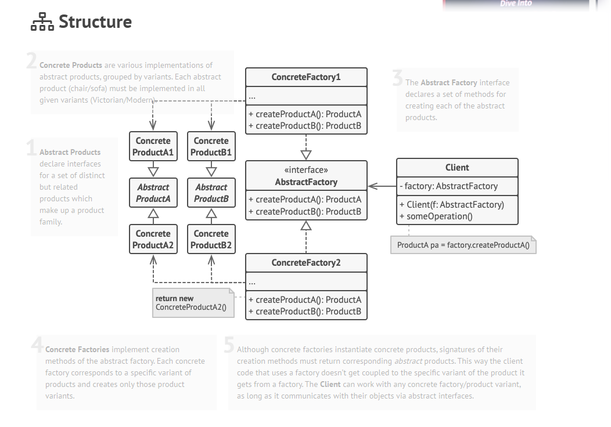
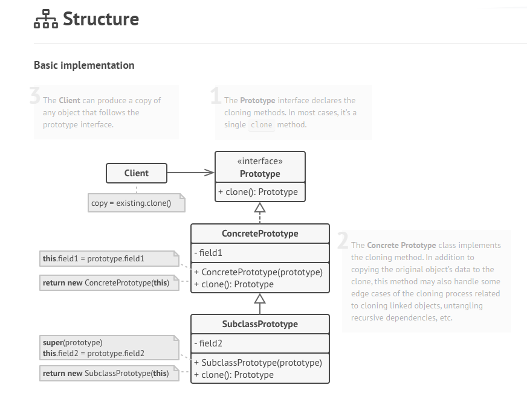
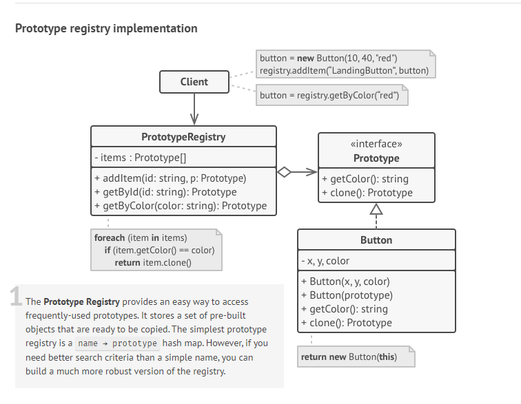
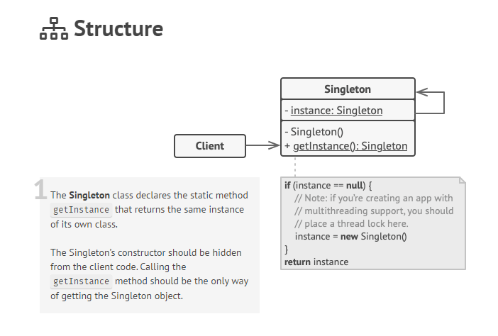

# Design Patterns en C# : Abstract Factory, Builder, Prototype, Singleton

Les **Design Patterns** sont des solutions réutilisables à des problèmes récurrents dans le développement logiciel. Ici, nous allons explorer les patterns "Abstract Factory", "Builder", "Prototype" et "Singleton" en C# avec des explications et des exemples détaillés.

---

## Abstract Factory

### Définition
Le **pattern Abstract Factory** fournit une interface pour créer des familles d'objets liés ou dépendants sans spécifier leurs classes concrètes. Il est particulièrement utile lorsque vous avez plusieurs variantes d'une famille d'objets et que vous souhaitez garantir qu'ils soient utilisés ensemble.

### Cas d'utilisation
- Lorsque vous devez garantir que les objets créés sont compatibles entre eux.
- Lorsque votre application doit prendre en charge plusieurs familles de produits.
- Exemple : création de composants GUI spécifiques à une plateforme (Windows, MacOS, etc.).

### Structure


### Exemple en C#
```csharp
// Interfaces des produits
public interface IButton
{
    void Render();
}

public interface ICheckbox
{
    void Render();
}

// Implémentations concrètes des produits
public class WindowsButton : IButton
{
    public void Render() => Console.WriteLine("Rendering Windows Button");
}

public class MacOSButton : IButton
{
    public void Render() => Console.WriteLine("Rendering MacOS Button");
}

public class WindowsCheckbox : ICheckbox
{
    public void Render() => Console.WriteLine("Rendering Windows Checkbox");
}

public class MacOSCheckbox : ICheckbox
{
    public void Render() => Console.WriteLine("Rendering MacOS Checkbox");
}

// Interface de la fabrique abstraite
public interface IGUIFactory
{
    IButton CreateButton();
    ICheckbox CreateCheckbox();
}

// Fabriques concrètes
public class WindowsFactory : IGUIFactory
{
    public IButton CreateButton() => new WindowsButton();
    public ICheckbox CreateCheckbox() => new WindowsCheckbox();
}

public class MacOSFactory : IGUIFactory
{
    public IButton CreateButton() => new MacOSButton();
    public ICheckbox CreateCheckbox() => new MacOSCheckbox();
}

// Client
public class Application
{
    private readonly IButton _button;
    private readonly ICheckbox _checkbox;

    public Application(IGUIFactory factory)
    {
        _button = factory.CreateButton();
        _checkbox = factory.CreateCheckbox();
    }

    public void Render()
    {
        _button.Render();
        _checkbox.Render();
    }
}

// Utilisation
var factory = new WindowsFactory();
var app = new Application(factory);
app.Render();
```

---

## Builder

### Définition
Le **pattern Builder** permet de construire des objets complexes étape par étape. Il sépare la construction d’un objet de sa représentation, ce qui permet d'utiliser le même processus de construction pour différentes représentations.

### Cas d'utilisation
- Lorsque vous devez construire un objet complexe composé de plusieurs étapes.
- Lorsque vous voulez isoler le code de construction du code de représentation.
- Exemple : création d'une maison ou d'un document complexe (PDF, HTML, etc.).

### Structure


### Exemple en C#
```csharp
// Produit complexe
public class House
{
    public string Walls { get; set; }
    public string Roof { get; set; }
    public string Foundation { get; set; }

    public override string ToString()
    {
        return $"House with {Walls} walls, {Roof} roof, and {Foundation} foundation.";
    }
}

// Interface du constructeur
public interface IHouseBuilder
{
    void BuildWalls();
    void BuildRoof();
    void BuildFoundation();
    House GetResult();
}

// Constructeur concret
public class ConcreteHouseBuilder : IHouseBuilder
{
    private House _house = new House();

    public void BuildWalls() => _house.Walls = "Concrete";

    public void BuildRoof() => _house.Roof = "Concrete";

    public void BuildFoundation() => _house.Foundation = "Concrete";

    public House GetResult() => _house;
}

// Directeur
public class Director
{
    private IHouseBuilder _builder;

    public Director(IHouseBuilder builder)
    {
        _builder = builder;
    }

    public void Construct()
    {
        _builder.BuildFoundation();
        _builder.BuildWalls();
        _builder.BuildRoof();
    }
}

// Utilisation
var builder = new ConcreteHouseBuilder();
var director = new Director(builder);
director.Construct();
House house = builder.GetResult();
Console.WriteLine(house);
```

---

## Prototype

### Définition
Le **pattern Prototype** permet de créer de nouveaux objets en copiant des instances existantes, plutôt que de les créer à partir de zéro. Cela est particulièrement utile lorsqu'il est coûteux ou complexe de créer un nouvel objet à partir de rien. 


### Cas d'utilisation
- Lorsque la création d’un objet est coûteuse ou complexe.
- Lorsque vous avez besoin d’une copie exacte d’un objet existant.
- Exemple : systèmes de gestion de ressources graphiques, éditeurs de graphismes.

### Structure



### Exemple en C#
```csharp
// Classe Prototype de base
public abstract class Shape
{
    public string Color { get; set; }

    protected Shape(string color)
    {
        Color = color;
    }

    public Shape Clone()
    {
        return (Shape)this.MemberwiseClone();
    }
}

// Classe concrète
public class Circle : Shape
{
    public int Radius { get; set; }

    public Circle(string color, int radius) : base(color)
    {
        Radius = radius;
    }
}

// Utilisation
var circle1 = new Circle("Red", 10);
var circle2 = (Circle)circle1.Clone();

Console.WriteLine($"Circle1: {circle1.Color}, Radius: {circle1.Radius}");
Console.WriteLine($"Circle2: {circle2.Color}, Radius: {circle2.Radius}");
```

---

## Singleton

### Définition
Le **pattern Singleton** garantit qu'une classe n'a qu'une seule instance et fournit un point d'accès global à cette instance. Il est souvent utilisé pour gérer des ressources partagées ou un état global.

### Cas d'utilisation
- Lorsque vous avez besoin d'une seule instance d'une classe (exemple : gestion de la configuration ou connexion à une base de données).
- Lorsque vous devez fournir un accès global à une instance.

### Structure


### Exemple en C#
```csharp
public class Singleton
{
    private static Singleton _instance;

    // Constructeur privé pour empêcher l’instanciation.
    private Singleton() { }

    public static Singleton Instance
    {
        get
        {
            if (_instance == null)
            {
                _instance = new Singleton();
            }
            return _instance;
        }
    }

    public void DoSomething()
    {
        Console.WriteLine("Singleton en action !");
    }
}

// Utilisation
var singleton = Singleton.Instance;
singleton.DoSomething();
```


